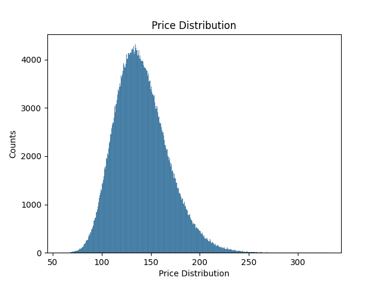
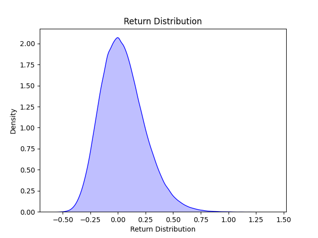
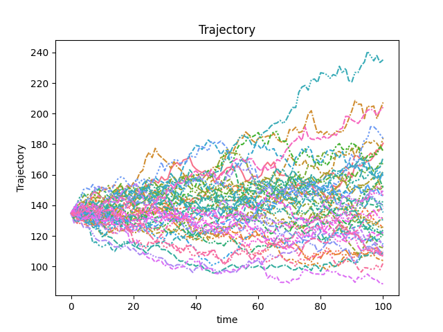

# Finance Monte-Carlo Simulation using PyTorch

- An easy-to-use python package to do Monte-Carlo Simulation on stock prices
- GPU accelerated Monte-Carlo simulation, that could allow simulation more random walkers without a large time penalty

## Installation

```bash
pip install pyfmc
```

## Geometric Brownian Motion Simulation

### Configure the simulation

```python
import pandas as pd
import matplotlib.pyplot as plt
from pyfmc.simulations.gbm import GBM

data_path = "./tests/data/AAPL.csv" # Replace with one's desired data
simulation = GBM(
        df=pd.read_csv(data_path),
        n_walkers=500_000,
        n_steps=100,
        n_trajectories=50,
        open_index="Open",  # Make sure the DataFrame has column index specified here
        close_index="Close", # Make sure the DataFrame has column index specified here
    )
result = simulation.simulate()
```

### Simulation Results

#### Price Distribution

```python
price_dist = result.price_distribution()
price_dist.plot(bins=500)
plt.show()
```



#### Return Distribution

```python
return_dist = result.return_distribution()
return_dist.plot(kde=True)
plt.show()
```



### Walkers Trajectories

```python
trajectories = result.trajectories()
trajectories.plot()
plt.show()
```



### Value at Risk (VaR)

```python
var = result.VaR(alpha=5)
# output: -0.2515...
# The worst 5% chance -> -25% return
```

## For Development

Python virtual environment:

```bash
python3 -m venv .venv
source .venv/bin/activate
pip3 install -r requirements.txt
```

## Reference

- [How to Use Monte Carlo Simulation With GBM (Investopedia)](https://www.investopedia.com/articles/07/montecarlo.asp)
- [Understanding Value at Risk (VaR) and How It’s Computed (Investopedia)](https://www.investopedia.com/terms/v/var.asp)
